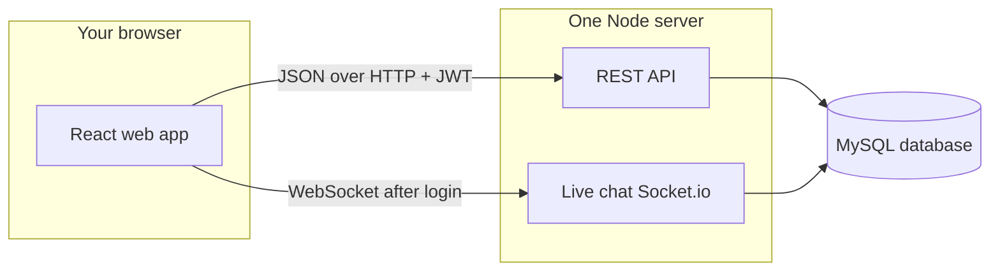

# Student Skill Exchange & Learning Marketplace

## 1. Project overview

**Domain:** Peer-to-peer skill learning among university students: offer a skill, request a skill, match with others at the same institution, chat in real time, schedule sessions, complete free or paid exchanges, and leave reviews.

**Problem solved:** Central place to discover compatible learners/teachers, align **free swap** vs **paid** tutoring, run **atomic** booking and payment flows, and keep an auditable history (sessions, payments, reputation).

**Group & team**

| | |
|--|--|
| **Group number** | **25** |
| **Members** | Iman Fatima (BSCS24044); Riham Awan (BSCS24110); Momina Yasin (BSCS24130) |

---

## 2. Tech stack

| Layer | Technology |
|--------|------------|
| **Frontend** | React 19, Vite 8, React Router 7 |
| **Backend** | Node.js 18+, Express 4 |
| **Database** | MySQL 8 (or 5.7) |
| **Auth** | JWT (`jsonwebtoken`), bcrypt password hashing |
| **Real-time** | Socket.io (server + `socket.io-client` on the web app) |
| **API docs** | OpenAPI 3 served via Swagger UI (`swagger-ui-express`); spec file: `backend/src/openapi.json` |
| **Validation** | `express-validator` |
| **Charts (UI)** | Recharts |
| **Other** | CORS, `dotenv` |

---

## 3. System architecture

**Big picture:** You use a website in the browser. That website is a React application. When you sign in, browse skills, or send data, the React app sends **HTTP requests** to our **Node.js server** (Express). The server reads and writes data in **MySQL**. So: **browser → API server → database**.

**Live chat:** Chat is not only HTTP. After you log in, the app also opens a **live connection** (Socket.io) to the same server. That way new messages can show up quickly without refreshing the page. Messages are still saved through the API first; the socket is used to notify the other user in real time.

**Security:** After login, the server gives the app a **JWT** (a signed token). The app sends it on later requests so the server knows who you are (student, admin, or superadmin).

**Heavy work in the database:** When a flow must succeed or fail as a whole (for example “create exchange + session + update request”), the server runs those SQL steps inside a **transaction** so the database never ends up half-updated.



---

## 4. UI examples (max 3)

Screenshots live in `media/` as: `ui-RequestedSkills.png`, `ui-OfferedSkills.png`, `ui-conversations.png`.

### 1) Requested skills


**Route:** `/student/requested-skills`

**What you see and why it matters:** Students add and manage **learning requests** (skill, preferred time, free vs paid). These rows drive **matching** against other users’ offers. This screen matters because every exchange needs a clear “what I want to learn” record tied to the same university rules as offers.

### 2) Offered skills


**Route:** `/student/offered-skills`

**What you see and why it matters:** Students declare **what they can teach**, including paid/free mode and optional price. Peers match against these offers. This screen matters because it is the other half of the marketplace: without offers, requests cannot turn into sessions and exchanges.

### 3) Conversations (chat)


**Route:** `/student/conversations`

**What you see and why it matters:** Students open a thread with another user, send messages, and can mark **exchange readiness** so both sides agree before confirming a swap. This screen is required because users must coordinate before the system creates exchanges and sessions.

---

## 5. Setup & installation

### Prerequisites

- **Node.js** 18 or newer (`node -v`)
- **MySQL** 8 (or 5.7) with a user that can create databases and tables
- **Git** (to clone the repository)

### Repository layout *(deviations from a flat “routes at backend root” template)*

This repo matches a typical monorepo layout. The coursework template sometimes shows `backend/routes` at the top level; here code lives under **`backend/src/`** (`routes/v1`, `controllers`, `services`, `middleware`). There is **no separate `models/` folder** — data access is implemented in **services** with SQL. **`server.js`** is at `backend/src/server.js`.

### Install dependencies

```bash
# Backend
cd backend
npm install

# Frontend (from repository root)
cd ../frontend
npm install
```

### Environment variables

**Backend** — copy `backend/.env.example` to `backend/.env` and set:

| Variable | Meaning | Example |
|----------|---------|---------|
| `PORT` | HTTP port for API + Socket.io | `5000` |
| `DB_HOST` | MySQL host | `localhost` |
| `DB_PORT` | MySQL port | `3306` |
| `DB_USER` | MySQL user | `root` |
| `DB_PASSWORD` | MySQL password | *(your local password)* |
| `DB_NAME` | Database name | `skill_exchange_db` |
| `JWT_SECRET` | Secret for signing tokens | *(long random string; never commit real values)* |
| `JWT_EXPIRES_IN` | Token lifetime | `7d` |

**Frontend** — copy `frontend/.env.example` to `frontend/.env`:

| Variable | Meaning | Example |
|----------|---------|---------|
| `VITE_API_URL` | API base URL (no trailing slash) | `http://localhost:5000` |

### Initialise the database

From MySQL (CLI or Workbench), in order:

1. Run `database/schema.sql` — creates database, tables, constraints, triggers, views, and baseline indexes.
2. Run `database/seed.sql` — sample universities, users, students, admins, skills, etc.

Optional for coursework analysis:

3. Run `database/performance.sql` — EXPLAIN / EXPLAIN ANALYZE and optional extra indexes (see **§10**; avoid running index-creation twice on the same DB without checking duplicates).
4. Run `database/acid_transactions.sql` if you use the bundled stored-procedure examples.

### Start servers

**Terminal 1 — backend**

```bash
cd backend
npm run dev
```

API: `http://localhost:5000` · Swagger UI: `http://localhost:5000/api-docs`

**Terminal 2 — frontend**

```bash
cd frontend
npm run dev
```

Open the URL Vite prints (usually `http://localhost:5173`).

### NPM scripts

| Location | Script | Purpose |
|----------|--------|---------|
| `backend` | `npm run dev` | Run API with Node `--watch` |
| `backend` | `npm start` | Production-style run (no watch) |
| `frontend` | `npm run dev` | Vite dev server |
| `frontend` | `npm run build` | Production build → `frontend/dist` |
| `frontend` | `npm run preview` | Preview production build |
| `frontend` | `npm run lint` | ESLint |

---

## 6. User roles & test credentials

**Seeded password for all sample Students:** `Password123!` (see comment at top of `database/seed.sql`).

| Role | Description | Can | Cannot (typical) |
|------|-------------|-----|---------------------|
| **student** | University learner | Manage own offered/requested skills, conversations, exchanges (within rules), matching profile, skill quiz when required | Access other universities’ admin tools; superadmin CRUD |
| **admin** | University-scoped administrator | View/manage students and reports for **their** university | Manage other universities or global skill catalog (unless also superadmin) |
| **superadmin** | Platform operator | CRUD universities, skills, admin accounts; global reports | N/A (highest privilege) |

**Example logins (from seed)**

| Role | Email | Notes |
|------|-------|--------|
| Student *(verified in seed — use for full student flows)* | `fatima.malik@itu.edu.pk` | `StudentID` 24, `IsAdminVerified = 1` |
| Student *(verified)* | `zainab.hussain@itu.edu.pk` | `StudentID` 26, `IsAdminVerified = 1` |
| University admin (ITU) | `admin.itu@itu.edu.pk` | Admin for university 1 |
| Superadmin | `superadmin@skillexchange.edu.pk` | Platform-wide |

*Many students in seed have `IsAdminVerified = 0`; those accounts may be redirected to pending verification until an admin approves. Prefer rows with `IsAdminVerified = 1` for end-to-end demos. Adjust in DB or seed if you need all demo students verified.*

---

## 7. Feature walkthrough

| Feature | What it does | Role | UI / route | API (examples) |
|---------|----------------|------|------------|----------------|
| Register / login | Create user; issue JWT | All | `/register`, `/login` | `POST /api/v1/auth/register`, `POST /api/v1/auth/login` |
| Student dashboard | Overview | Student | `/student` | — |
| Match profile (Form 1) | Profile + requested skills | Student | `/student/match-profile` | `POST /api/v1/matching/...` (see OpenAPI) |
| Offered / requested skills | CRUD teaching offers and learning requests | Student | `/student/offered-skills`, `/student/requested-skills` | `/api/v1/offered-skills`, `/api/v1/requested-skills` |
| Skill quiz | Evaluation gate for some skills | Student | `/student/quiz/:skillId` | `/api/v1/skill-quiz/...` |
| Conversations & messages | Chat + exchange readiness | Student | `/student/conversations` | `/api/v1/conversations/...` |
| Confirm exchange (Form 2) | Create exchanges/sessions from matched pairs | Student | `/student/confirm-exchange/:conversationId` | `POST /api/v1/transactions/confirm-form2` |
| Exchanges list | View exchanges | Student | `/student/exchanges` | `/api/v1/exchanges/...` |
| Transaction demo | Developer-oriented transaction testing | Student | `/student/transaction-demo` | `POST /api/v1/transactions/match-request`, `paid-exchange` |
| Admin students / reports / evaluations | University ops | Admin | `/admin/students`, `/admin/reports`, `/admin/evaluations` | `/api/v1/admin/...`, `/api/v1/reports` |
| Superadmin universities / skills / admins | Global config | Superadmin | `/superadmin/...` | `/api/v1/universities`, `/api/v1/admins`, `/api/v1/skills` |

*Exact method/path pairs are listed in **§11** and fully described in `backend/src/openapi.json`.*

---

## 8. Transaction scenarios

All of these use `withTransaction()` in `backend/src/services/transactions.js`: **BEGIN → queries → COMMIT**, or **ROLLBACK** on any error.

### A. `POST /api/v1/transactions/match-request`

- **Trigger:** Student submits matching offer + open request + conversation + session window.
- **Atomic bundle:** Validates offer, conversation, and open request → `INSERT Exchange` → `INSERT Session` → `UPDATE RequestedSkill` to `matched`.
- **Rollback:** Any failure (missing offer, closed request, DB error) rolls back all inserts/updates.
- **Code:** `exchange.service.js` → `matchRequestCreateExchangeSession` (called from `transactions.controller.js`).

### B. `POST /api/v1/transactions/paid-exchange`

- **Trigger:** Recording paid tutoring for an existing exchange.
- **Atomic bundle:** Validates exchange → updates type/status as required → `INSERT PaidExchange` / `Payment` per service logic (order matters for triggers).
- **Rollback:** Invalid price, missing exchange, or constraint/trigger failure → full rollback.
- **Code:** `createPaidExchangeWithPayment` in `exchange.service.js`.

### C. `POST /api/v1/transactions/confirm-form2`

- **Trigger:** Student confirms Form 2 after mutual readiness in a conversation.
- **Atomic bundle:** Creates one or more exchanges and initial sessions (and related rows) per validated pairs.
- **Rollback:** Validation errors (`INVALID_PAIRS`, skill mismatch, etc.) or DB errors → rollback.
- **Code:** `confirmForm2ExchangeSessions` in `exchange.service.js` (entry: `transactions.controller.js` → `confirmForm2`).

---

## 9. ACID compliance (mapping)

| Property | Meaning here | Concrete implementation |
|----------|----------------|---------------------------|
| **Atomicity** | All-or-nothing writes | `withTransaction()` in `transactions.js`; multi-step flows in `exchange.service.js` commit or roll back together. |
| **Consistency** | Valid state only | FK constraints, `CHECK`-style rules in schema, triggers (e.g. payment validation on `Exchange` type — see schema/trigger comments). |
| **Isolation** | Concurrent transactions don’t corrupt rows | MySQL default isolation; business logic uses transactional reads/writes; optional `FOR UPDATE` patterns in `acid_transactions.sql` demos. |
| **Durability** | Committed data survives restart | InnoDB redo log; successful `COMMIT` in `withTransaction`. |

---

## 10. Indexing & performance

**Baseline indexes** are created in `database/schema.sql` (examples):

- `idx_user_created`, `idx_student_university`, `idx_student_reputation`
- `idx_slot_offer_status`, `idx_timeslot_offer`, `idx_timeslot_status`
- `idx_exch_type`, `idx_session_exch`, `idx_session_time`, `idx_session_status`
- `idx_payment_exch_status`, `idx_message_created`
- Skill quiz / portfolio: `idx_question_skill`, `idx_eval_student_skill`, `idx_portfolio_student`, etc.

**Additional indexes** for coursework analysis appear in **`database/performance.sql` §3**, e.g.:

- `idx_offer_student_skill`, `idx_offer_skill` — faster offer discovery by student/skill
- `idx_request_skill_status` — filter open requests by skill
- `idx_exch_status_created` — completed exchanges sorted by time (reduces full scans vs §1 Query 3 commentary)
- `idx_msg_conv_time` — messages by conversation in time order (reduces filesort vs §1 Query 5)

**Before/after:** `performance.sql` documents **EXPLAIN** and **EXPLAIN ANALYZE** for the same queries before and after adding indexes (see embedded `RESULT` / `WHAT IT MEANS` comments). Summaries: e.g. completed-exchange listing moves from full table scan + filesort toward index-friendly plans after `idx_exch_status_created`; message threads benefit from `(ConversationID, CreatedAt)`.

---

## 11. API reference (quick)

Base path: **`/api/v1`**. **Auth:** send `Authorization: Bearer <JWT>` unless noted.

| Method | Route (prefix `/api/v1`) | Auth | Purpose |
|--------|---------------------------|------|---------|
| GET | `/health` | No | Health check |
| POST | `/auth/register`, `/auth/login` | No | Register / login |
| GET/POST/PATCH/DELETE | `/users/...` | Yes | User profiles (RBAC) |
| POST | `/transactions/match-request` | Yes (student) | Atomic exchange + session |
| POST | `/transactions/paid-exchange` | Yes (student) | Paid exchange + payment |
| POST | `/transactions/confirm-form2` | Yes (student) | Form 2 confirmation |
| GET/POST/PATCH | `/conversations/...` | Yes | Conversations & messages |
| CRUD | `/offered-skills`, `/requested-skills` | Yes (student) | Offers & requests |
| GET/POST | `/matching/...` | Yes | Matching / forms |
| GET/POST/PATCH | `/exchanges`, `/sessions` | Yes | Exchanges & sessions |
| GET/POST | `/reviews`, `/payments`, `/portfolio` | Yes | Reviews, payments, portfolio |
| GET/POST | `/admin/...` | Yes (admin) | University admin |
| GET/POST | `/admins`, `/universities`, `/reports`, `/skills` | Yes (superadmin where applicable) | Platform admin |
| GET | `/api-docs` | No | Swagger UI (interactive) |

**Full detail:** `backend/src/openapi.json` (same operations as Swagger UI).

**Course spec naming:** If a PDF checklist requires `docs/swagger.yaml`, generate or copy from the OpenAPI file (e.g. export from Swagger UI, or convert JSON → YAML with a small script). The **canonical** machine-readable spec in this repo is **`backend/src/openapi.json`**.

---

## 12. Known issues & limitations

- **Payments are not a real payment gateway.** `paid-exchange` and related flows record amounts and status in the database (demo-style). There is no integration with banks, cards, or mobile wallets; production would need a PSP and webhooks.

- **No email / SMS notifications.** Password reset, verification reminders, and session reminders are not sent automatically. Users rely on in-app views and admin actions.

- **Student verification is manual.** `IsAdminVerified` gates full student features; unverified accounts may see a pending state until a university admin approves them in the admin UI or data is updated in the DB.

- **Socket.io depends on the same API origin.** Chat assumes the client can reach the Socket.io server (same host/port as the API in typical setup). Misconfigured proxies or mixed HTTP/HTTPS can break the live connection.
